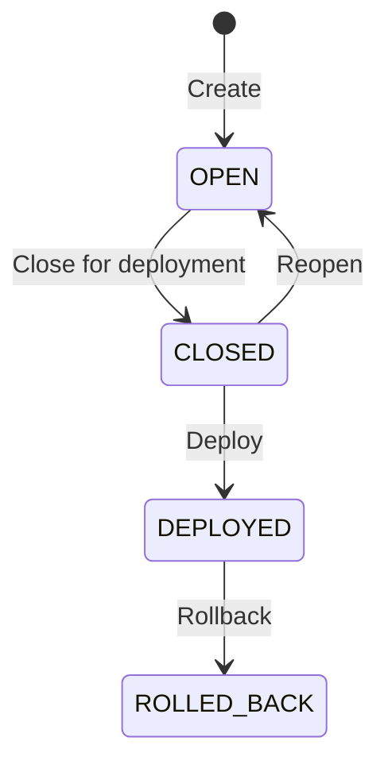

# Releases API

The Releases API enables management of content releases with atomic deployments and instant rollback capabilities.

## Endpoints

### List Releases

```http
GET /api/releases
```

Query parameters:
- `status` - Filter by status (OPEN, CLOSED, DEPLOYED, ROLLED_BACK)
- `createdBy` - Filter by creator user ID
- `limit` - Number of results (default: 20)
- `offset` - Pagination offset

Response:
```json
{
  "releases": [
    {
      "id": "12345",
      "name": "Q4 2024 Campaign",
      "description": "Holiday campaign content",
      "status": "OPEN",
      "createdBy": "user@example.com",
      "createdAt": "2024-01-15T10:00:00Z",
      "deploySeq": null,
      "deployedAt": null,
      "deployedBy": null
    }
  ],
  "total": 42,
  "limit": 20,
  "offset": 0
}
```

### Get Release

```http
GET /api/releases/:id
```

Response:
```json
{
  "id": "12345",
  "name": "Q4 2024 Campaign",
  "description": "Holiday campaign content",
  "status": "DEPLOYED",
  "createdBy": "user@example.com",
  "createdAt": "2024-01-15T10:00:00Z",
  "deploySeq": 42,
  "deployedAt": "2024-01-20T14:30:00Z",
  "deployedBy": "admin@example.com"
}
```

### Create Release

```http
POST /api/releases
```

Request body:
```json
{
  "name": "Feature XYZ Release",
  "description": "New feature implementation",
  "baseReleaseId": "12340" // Optional: copy content from another release
}
```

Response:
```json
{
  "id": "12346",
  "name": "Feature XYZ Release",
  "status": "OPEN",
  "createdBy": "user@example.com",
  "createdAt": "2024-01-15T10:00:00Z"
}
```

Required permission: `releases:create`

### Update Release

```http
PATCH /api/releases/:id
```

Request body:
```json
{
  "name": "Updated Release Name",
  "description": "Updated description",
  "status": "CLOSED" // Only OPEN → CLOSED allowed
}
```

Response: Updated release object

Required permission: `releases:update`

### Deploy Release

```http
POST /api/releases/:id/deploy
```

Request body:
```json
{
  "confirmationToken": "DEPLOY-CONFIRMED"
}
```

Response:
```json
{
  "success": true,
  "deployedRelease": {
    "id": "12345",
    "deploySeq": 43,
    "deployedAt": "2024-01-20T15:00:00Z"
  },
  "deploymentTimestamp": "2024-01-20T15:00:00Z"
}
```

Required permission: `releases:deploy`

### Rollback Release

```http
POST /api/releases/rollback
```

Request body:
```json
{
  "targetReleaseId": "12340",
  "confirmationToken": "ROLLBACK-CONFIRMED"
}
```

Response:
```json
{
  "success": true,
  "deployedRelease": {
    "id": "12340",
    "deploySeq": 44,
    "deployedAt": "2024-01-20T15:30:00Z"
  },
  "deploymentTimestamp": "2024-01-20T15:30:00Z"
}
```

Required permission: `releases:rollback`

### Compare Releases

```http
POST /api/releases/diff
```

Request body:
```json
{
  "fromReleaseId": "12340",
  "toReleaseId": "12345",
  "entityTypes": ["translation", "content"], // Optional filter
  "brandIds": ["brand-1", "brand-2"] // Optional filter
}
```

Response:
```json
{
  "fromRelease": { /* release object */ },
  "toRelease": { /* release object */ },
  "changes": [
    {
      "entityId": "67890",
      "entityType": "translation",
      "entityName": "homepage.title",
      "changeType": "MODIFIED",
      "fromValue": "Welcome",
      "toValue": "Welcome to our site"
    }
  ],
  "summary": {
    "totalChanges": 42,
    "added": 10,
    "modified": 30,
    "deleted": 2
  }
}
```

### Get Active Release

```http
GET /api/releases/active
```

Response:
```json
{
  "releaseId": "12345",
  "release": {
    "id": "12345",
    "name": "Current Production",
    "status": "DEPLOYED",
    "deploySeq": 42
  }
}
```

## Release Context

All API requests can specify a release context using the `X-CMS-Release` header:

```http
GET /api/translations
X-CMS-Release: 12345
```

This header:
- Filters all content to show only what's visible in that release
- Defaults to the latest deployed release if not specified
- Must reference a release the user has permission to access

## Status Transitions



## Permissions

| Permission | Description | Default Roles |
|------------|-------------|---------------|
| `releases:create` | Create new releases | editor, admin |
| `releases:read` | View releases | all authenticated |
| `releases:update` | Update release metadata | editor, admin |
| `releases:close` | Close releases for deployment | editor, admin |
| `releases:deploy` | Deploy releases to production | admin |
| `releases:rollback` | Rollback to previous releases | admin |
| `releases:delete` | Delete releases | admin |
| `releases:preview` | Preview release content | editor, admin |
| `releases:diff` | Compare releases | editor, admin |

## Error Responses

### 400 Bad Request
```json
{
  "statusCode": 400,
  "error": "Bad Request",
  "message": "Only CLOSED releases can be deployed"
}
```

### 403 Forbidden
```json
{
  "statusCode": 403,
  "error": "Forbidden",
  "message": "Insufficient permissions to deploy release"
}
```

### 404 Not Found
```json
{
  "statusCode": 404,
  "error": "Not Found",
  "message": "Release not found"
}
```

### 409 Conflict
```json
{
  "statusCode": 409,
  "error": "Conflict",
  "message": "A release with this name already exists"
}
```

## Examples

### Create and Deploy a Release

```bash
# 1. Create release
RELEASE_ID=$(curl -X POST http://localhost:3000/api/releases \
  -H "Authorization: Bearer $TOKEN" \
  -H "Content-Type: application/json" \
  -d '{"name": "Feature Update"}' \
  | jq -r '.id')

# 2. Make changes with release context
curl -X PUT http://localhost:3000/api/translations/key-123 \
  -H "Authorization: Bearer $TOKEN" \
  -H "X-CMS-Release: $RELEASE_ID" \
  -H "Content-Type: application/json" \
  -d '{"value": "Updated translation"}'

# 3. Close release
curl -X PATCH http://localhost:3000/api/releases/$RELEASE_ID \
  -H "Authorization: Bearer $TOKEN" \
  -H "Content-Type: application/json" \
  -d '{"status": "CLOSED"}'

# 4. Deploy
curl -X POST http://localhost:3000/api/releases/$RELEASE_ID/deploy \
  -H "Authorization: Bearer $TOKEN" \
  -H "Content-Type: application/json" \
  -d '{"confirmationToken": "DEPLOY-CONFIRMED"}'
```

### Compare and Rollback

```bash
# 1. Get current deployed release
CURRENT=$(curl http://localhost:3000/api/releases/active \
  -H "Authorization: Bearer $TOKEN" \
  | jq -r '.releaseId')

# 2. Compare with previous
curl -X POST http://localhost:3000/api/releases/diff \
  -H "Authorization: Bearer $TOKEN" \
  -H "Content-Type: application/json" \
  -d "{
    \"fromReleaseId\": \"12340\",
    \"toReleaseId\": \"$CURRENT\"
  }"

# 3. Rollback if needed
curl -X POST http://localhost:3000/api/releases/rollback \
  -H "Authorization: Bearer $TOKEN" \
  -H "Content-Type: application/json" \
  -d '{
    "targetReleaseId": "12340",
    "confirmationToken": "ROLLBACK-CONFIRMED"
  }'
```