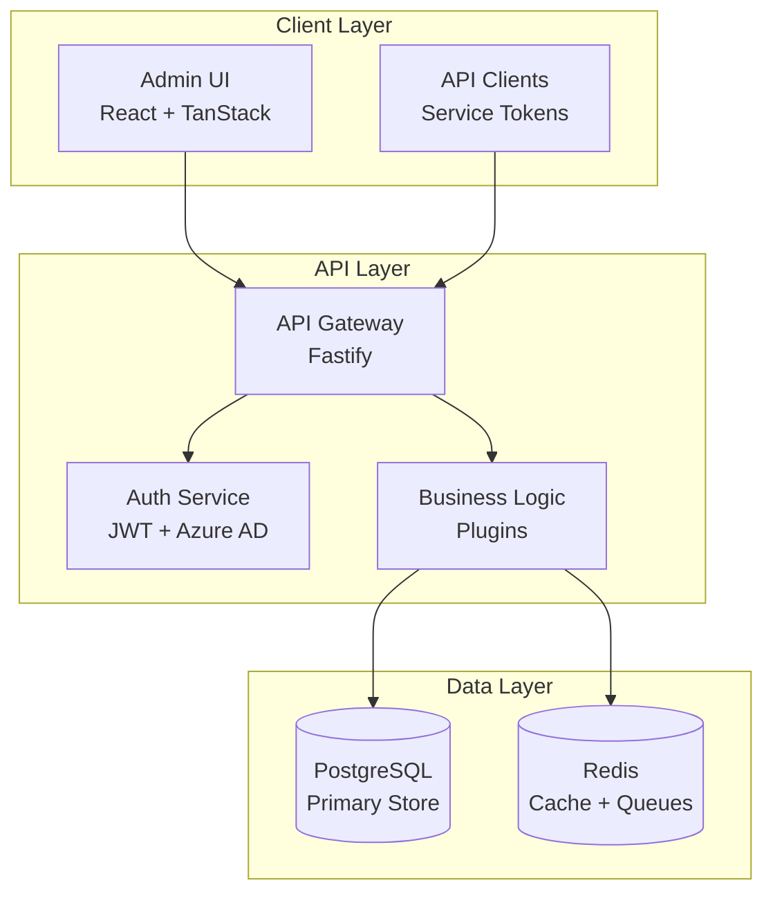

# Architecture Overview

The CMS Platform is designed as a modern, scalable content management system with enterprise-grade features and developer-friendly tooling.

## High-Level Architecture



## Core Principles

### 1. Type Safety First

- **End-to-end TypeScript** from database to UI
- **Shared contracts** using TypeBox schemas
- **Compile-time validation** preventing runtime errors

### 2. Plugin Architecture

The API server uses Fastify's plugin system for modularity:

```typescript
// External plugins (infrastructure)
fastify.register(authPlugin)
fastify.register(databasePlugin)

// Application plugins (business logic)
fastify.register(usersPlugin)
fastify.register(brandsPlugin)
```

### 3. Domain-Driven Design

Features are organized by business domain:
- **Users & Auth** - Authentication and user management
- **Brands** - Multi-brand configuration
- **Content** - Translations and localization
- **Releases** - Deployment and versioning

### 4. Multi-Tenant Isolation

Data isolation at multiple levels:
- **Brand-level** - Complete separation between brands
- **Jurisdiction-level** - Regional compliance requirements
- **Locale-level** - Language-specific content

## Key Components

### Authentication & Authorization

- **Azure AD Integration** via MSAL
- **JWT tokens** for API authentication
- **Role-Based Access Control** (RBAC)
- **Permission inheritance** system

### Content Management

- **Hierarchical structure**: Brand → Jurisdiction → Locale
- **Translation workflow** with approval states
- **Version control** for all content changes
- **Atomic releases** with rollback capability

### Performance & Scaling

- **Database indexing** on key queries
- **Redis caching** for frequent data
- **Connection pooling** for database efficiency
- **Horizontal scaling** ready architecture

## Technology Choices

### Why Fastify?

- **Performance** - One of the fastest Node.js frameworks
- **Schema validation** - First-class TypeBox support
- **Plugin ecosystem** - Modular architecture
- **Developer experience** - Excellent TypeScript support

### Why TurboRepo?

- **Monorepo benefits** - Shared code and atomic changes
- **Build performance** - Intelligent caching and parallelization
- **Developer experience** - Single command for all operations

### Why Drizzle ORM?

- **Type safety** - Full TypeScript inference
- **Performance** - Minimal overhead
- **Migrations** - Version-controlled schema changes
- **SQL-like syntax** - Familiar for developers

## Security Considerations

- **Authentication** - Azure AD with MFA support
- **Authorization** - Fine-grained RBAC
- **Data encryption** - At rest and in transit
- **Audit logging** - All sensitive operations tracked
- **Input validation** - Schema-based validation

## Deployment Architecture

### Development
- Local PostgreSQL and Redis via Docker
- Hot reloading for rapid development
- Seeded test data

### Production (Planned)
- Containerized deployment (Docker/Kubernetes)
- Load balancing across API instances
- Database replication for high availability
- CDN for static assets